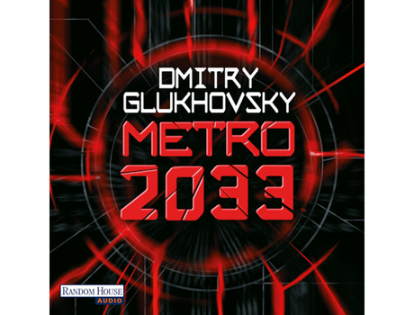

  

# 🚇 Metro 2033 — Tradução PT-BR

  
  
  

> ☢️ *“Caro moscovita e visitante da nossa capital! O metrô de Moscou é um meio de transporte que envolve um nível elevado de perigo.”*  
> — **Aviso clássico do Metrô de Moscou**

Seja bem-vindo às profundezas da penumbra moscovita. Este repositório hospeda o projeto de tradução independente, imersiva e literária para o português brasileiro de **Metro 2033**, a aclamada obra-prima de ficção científica pós-apocalíptica escrita por **Dmitry Glukhovsky**.

Esta versão foi estruturada nativamente para o **GitBook** e organizada via **GitHub**, oferecendo uma experiência de leitura digital moderna, limpa e focada em resgatar a atmosfera de horror claustrofóbico e existencialista que consagrou o universo da franquia.

🚇 ─── 💀 ─── 🔦 ─── ☣️ ─── 🚇

## 💀 O Universo de Metro 2033

No ano de 2033, a humanidade foi varrida da face da Terra. Os poucos milhares de sobreviventes de Moscou encontraram refúgio nas entranhas do metrô municipal — o maior abrigo contra radiação já construído pelo homem.

Lá embaixo, na escuridão eterna, o que restou da civilização se fragmentou em pequenos estados-anões que disputam recursos vitais como água, filtros e espaço habitável. Entre alianças comerciais e guerras ideológicas, novos perigos espreitam nos túneis escuros: aberrações mutantes e os temíveis **Negros** (*The Dark ones*).

### 🗺️ Estações e Facções Chave:
* **VDNKh (A Fronteira):** A estação natal do jovem Artyom. Próspera pela produção de seu famoso "chá de cogumelo", mas sob ataque constante dos terríveis Negros vindos do norte.
* **Aliança Hansa:** A liga de estações comerciais da Linha Circular, detentora de riquezas incomparáveis e do controle de fluxo de mercadorias.
* **A Linha Vermelha:** Facção comunista idealista que busca unificar o metrô sob a foice e o martelo.
* **Polis:** O último bastião cultural e científico da humanidade, situado na interseção de quatro linhas, governado por militares (*Kshatriyas*) e deuses do conhecimento (*Brahmins*).

🚇 ─── 💀 ─── 🔦 ─── ☣️ ─── 🚇

## 📖 Diretrizes desta Tradução

Para preservar a essência sombria e claustrofóbica da obra original, esta tradução segue diretrizes estilísticas rígidas:
* **Vocabulário Sensorial Denso:** Foco em manter o peso físico do metrô (a escuridão impenetrável, o mofo, o fedor, a paranoia dos túneis).
* **Precisão Terminológica:** Preservação fiel de armamentos russos (*Berdan, Stechkin, Kalashnikov*), nomenclaturas de facções e a ríspida linguagem militar dos Stalkers.
* **Narrativa Existencialista:** Cuidado especial com os debates filosóficos sobre a evolução e a decadência do *Homo sapiens* contra o *Homo novus*.

🚇 ─── 💀 ─── 🔦 ─── ☣️ ─── 🚇

## 🗂️ Como Navegar pelo Livro

A navegação no GitBook é gerenciada de forma dinâmica pelo arquivo `SUMMARY.md`. Você pode acessar os capítulos traduzidos diretamente pelo menu lateral ou pelos links abaixo:

* [Página Inicial / Introdução 🚇](README.md)
* [Capítulo 1 — O Fim da Terra 💀](capitulo-1.md)
* [Capítulo 2 — O Caçador 🔦](capitulo-2.md)
* [Capítulo 3 — Se Eu Não Voltar ☣️](capitulo-3.md)
* *(Próximos capítulos em desenvolvimento...)*

🚇 ─── 💀 ─── 🔦 ─── ☣️ ─── 🚇

## ✍️ Créditos e Preservação Digital

* **Autor Original:** Dmitry Glukhovsky (Copyright © 2007).
* **Base de Tradução:** Baseado na célebre tradução inglesa de Natasha Randall (Copyright © 2009) e no manuscrito digital distribuído historicamente.

  

*Homenagem especial à comunidade digital de preservação Warez-BB e ao revisor Sh4dovvv pelo resgate histórico do manuscrito original em 2010.*

> *“Aquele que for corajoso e paciente o bastante para encarar a escuridão a vida inteira, será o primeiro a ver um vislumbre de luz nela.”*  
> — **A máxima de Khan**

  

